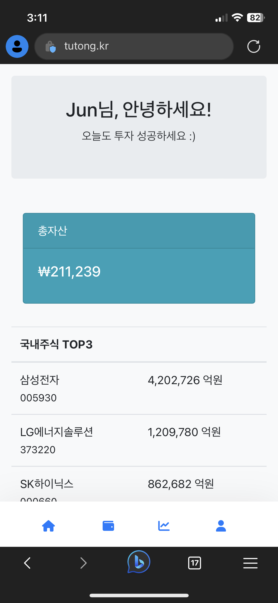
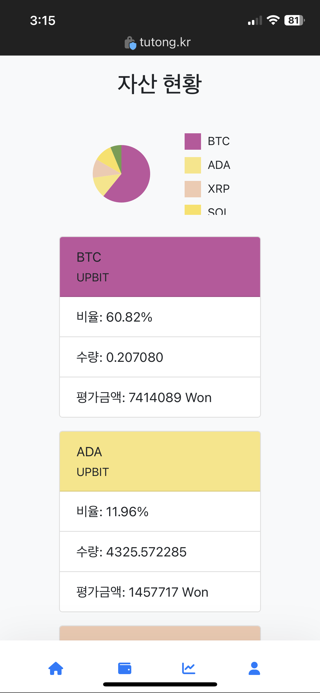
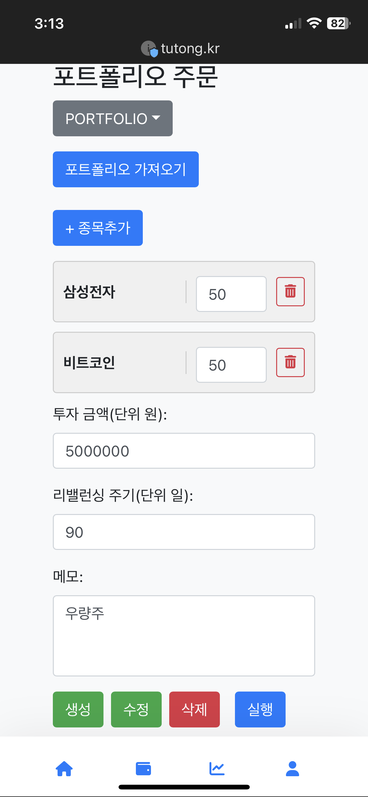
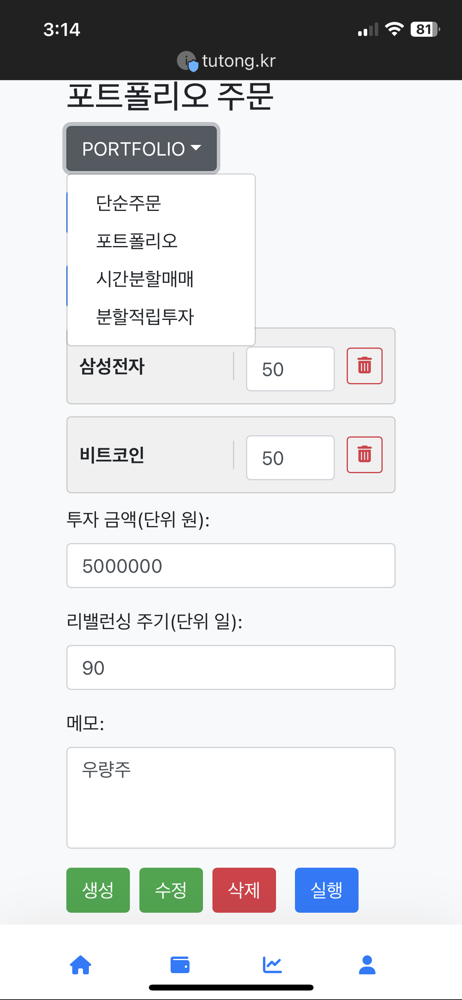
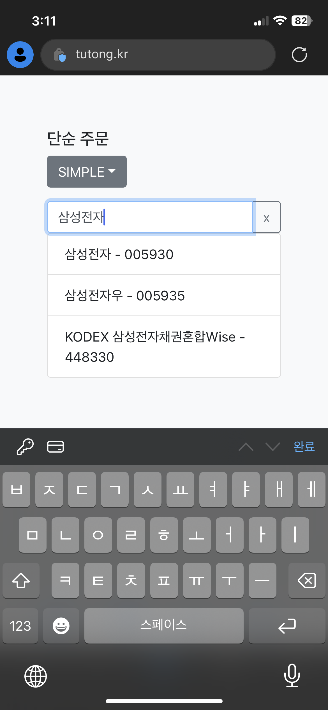

# tutong 화면

## 홈화면

- 자신이 등록한 거래소의 총 자산을 표시
- 국내주식 시가총액 TOP3 종목 표시
- 코인 시가총액 TOP3 종목 표시

## 계좌 잔고

- 잔고의 각 자산별 비율을 나타냄
- 비율이 높은 순으로 자산과 해당 거래소를 표시
- 비율에 따라 원형 차트 생성

## 포트폴리오 주문

- 원하는 종목 추가
- 각 종목마다 비율 설정
- 금액 설정
- 리밸런싱 설정

## 메뉴

- 드롭다운으로 메뉴 선택

## 종목 검색

- 종목 검색 (5개씩 pagination)
